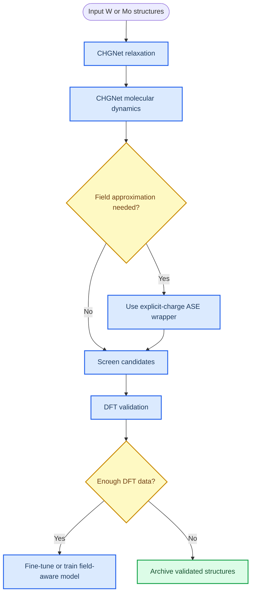

# Flash sintering simulation workflow for tungsten and molybdenum using CHGNet and ASE

_Project note for using CHGNet as a fast screening and pre-relaxation engine before higher-fidelity DFT validation._

---

## Goal

Use CHGNet as a pretrained machine-learned interatomic potential to accelerate exploratory simulations of flash sintering in tungsten and molybdenum. The intended workflow is:

- Relax candidate structures before sending selected cases to DFT.
- Run molecular dynamics to screen nucleation, growth, defect motion, and metastable phase candidates.
- Approximate field-driven trends in a clearly marked qualitative mode.
- Feed promising structures and trajectories into BigDFT, VASP, Quantum ESPRESSO, or another validated electronic-structure workflow.

CHGNet is useful out of the box for energies, forces, stresses, and magnetic moments.[^1] It is not a native external-electric-field model, and magnetic moment should not be treated as electric charge.



## Setup on the headless Linux workstation

This project already has a local micromamba executable, so a full Conda install is not required. Activate the environment created for this workflow:

```bash
cd /home/ricfulop/Desktop/Cursor/flash-modelling
source env/activate_flash_chgnet.sh
```

The activation helper uses:

```text
/home/ricfulop/Desktop/Cursor/.local-bigdft-opencl/bin/micromamba
/home/ricfulop/Desktop/Cursor/.local-flash-chgnet/envs/flash_chgnet
```

The frozen package list is recorded in:

```text
env/flash_chgnet_requirements.txt
```

Verified core package versions:

```text
Python 3.10.20
chgnet==0.4.2
ase==3.28.0
pymatgen==2025.10.7
numpy==2.2.6
matplotlib==3.10.9
tqdm==4.67.3
```

If you later need a standard Conda installation for interactive use, install Miniforge or Mambaforge separately. It is not needed for the current `flash_chgnet` workflow.

## Relax a tungsten BCC structure

A relaxed structure is a local minimum-energy atomic configuration, usually with forces below a chosen tolerance. This example uses pymatgen for structure handling, ASE for optimization, and CHGNet as the force calculator.[^2]

```python
from chgnet.model import CHGNetCalculator
from pymatgen.core import Lattice, Structure
from pymatgen.io.ase import AseAtomsAdaptor
from ase.optimize import FIRE


def make_bcc_w(a=3.1652):
    """Primitive BCC tungsten cell. Lattice constant is a room-temperature reference value."""
    lattice = Lattice.cubic(a)
    return Structure(lattice, ["W", "W"], [[0, 0, 0], [0.5, 0.5, 0.5]])

# Option A: read from file.
# structure = Structure.from_file("W_bulk.cif")

# Option B: create manually.
structure = make_bcc_w()

atoms = AseAtomsAdaptor.get_atoms(structure)
atoms.calc = CHGNetCalculator()

optimizer = FIRE(atoms)
optimizer.run(fmax=0.01)

print("Relaxed energy:", atoms.get_potential_energy())
atoms.write("W_relaxed.cif")
```

For molybdenum, replace the element symbol and lattice constant:

```python
def make_bcc_mo(a=3.147):
    lattice = Lattice.cubic(a)
    return Structure(lattice, ["Mo", "Mo"], [[0, 0, 0], [0.5, 0.5, 0.5]])
```

## Molecular dynamics for kinetics and flash screening

CHGNet provides an MD convenience wrapper, and ASE also provides MD integrators.[^3] Start with short, small-supercell runs before scaling to larger cells.

```python
from chgnet.model import CHGNet
from chgnet.model import CHGNetCalculator
from chgnet.model.dynamics import MolecularDynamics
from pymatgen.core import Lattice, Structure
from pymatgen.io.ase import AseAtomsAdaptor


structure = Structure(
    Lattice.cubic(3.1652),
    ["W", "W"],
    [[0, 0, 0], [0.5, 0.5, 0.5]],
)
atoms = AseAtomsAdaptor.get_atoms(structure * (3, 3, 3))

chgnet = CHGNet.load()
atoms.calc = CHGNetCalculator(model=chgnet)

md = MolecularDynamics(
    atoms=atoms,
    temperature=1273,  # K, approximately 1000 C
    timestep=2.0,     # fs
    trajectory="W_md.traj",
    logfile="W_md.log",
    loginterval=100,
)

md.run(5000)
```

For flash-like exploratory conditions:

- Run temperature ramps rather than a single fixed-temperature trajectory.
- Save trajectories frequently enough to detect short-lived defect events.
- Track coordination, centrosymmetry, local structure classification, and surface atom behavior.
- Treat CHGNet MD as screening, not as final evidence for flash-field mechanisms.

## Electric field approximations

Standard CHGNet does not include a native external electric field. A field term can be approximated in ASE by wrapping the CHGNet calculator and adding an explicit force contribution:

\[
F_i = q_i E
\]

This requires a charge model that you choose and document. For elemental bulk W or Mo, nominal atomic charges are usually zero, so this term should often be zero unless you are modeling charged defects, ions, surfaces, adsorbates, or another explicit charge assignment.

```python
import numpy as np
from ase.calculators.calculator import Calculator, all_changes


class ElectricFieldCalculator(Calculator):
    """ASE calculator wrapper that adds a fixed-charge external field term."""

    implemented_properties = ["energy", "forces"]

    def __init__(self, base_calc, charges, field_strength=0.05, direction=(0, 0, 1)):
        super().__init__()
        self.base_calc = base_calc
        self.charges = np.asarray(charges, dtype=float)

        direction = np.asarray(direction, dtype=float)
        norm = np.linalg.norm(direction)
        if norm == 0:
            raise ValueError("direction must be non-zero")
        self.efield = field_strength * direction / norm

    def calculate(self, atoms=None, properties=("energy", "forces"), system_changes=all_changes):
        super().calculate(atoms, properties, system_changes)

        self.base_calc.calculate(atoms, properties, system_changes)
        results = dict(self.base_calc.results)

        positions = atoms.get_positions()
        field_forces = self.charges[:, None] * self.efield[None, :]
        field_energy = -np.sum(self.charges * (positions @ self.efield))

        results["forces"] = results["forces"] + field_forces
        results["energy"] = results["energy"] + field_energy
        self.results = results
```

Usage:

```python
base_calc = CHGNetCalculator(model=chgnet)

# For pure elemental bulk, start with zeros unless you have a defined charge model.
charges = np.zeros(len(atoms))

atoms.calc = ElectricFieldCalculator(
    base_calc=base_calc,
    charges=charges,
    field_strength=0.05,
    direction=(0, 0, 1),
)
```

Do not use CHGNet `magmom` values as charges. Magnetic moments and electric charges are different observables.

## NEB tests for barrier lowering

Use nudged elastic band calculations to compare a reaction or defect migration path with and without an approximate field term.[^4] Each image should get its own calculator instance.

```python
from ase.neb import NEB
from ase.optimize import FIRE


images = [initial]
for _ in range(5):
    image = initial.copy()
    images.append(image)
images.append(final)

neb = NEB(images)
neb.interpolate()

for image in images:
    base_calc = CHGNetCalculator(model=chgnet)
    charges = get_charges_for_image(image)  # user-defined, fixed, and documented
    image.calc = ElectricFieldCalculator(
        base_calc=base_calc,
        charges=charges,
        field_strength=0.05,
        direction=(0, 0, 1),
    )

optimizer = FIRE(neb)
optimizer.run(fmax=0.05)
```

Compare:

- Barrier height without the field wrapper
- Barrier height with a documented charge and field model
- Whether the qualitative trend survives DFT validation

## Analysis targets

For each trajectory or relaxation batch, record:

- Total energy and force convergence
- Radial distribution function and local coordination
- Common-neighbor analysis or polyhedral template matching in OVITO
- Defect counts, vacancy/interstitial persistence, and Frenkel-pair lifetimes
- Surface atom motion and evaporation candidates
- Candidate metastable motifs for DFT re-relaxation

Avoid interpreting CHGNet magnetic moments as electron-hole recombination or hot-electron emission. Those mechanisms require electronic-structure evidence beyond a classical or ML interatomic-potential trajectory.

## DFT integration

Recommended screening loop:

1. Generate candidate W/Mo structures and trajectories with CHGNet.
2. Filter for low energy, persistent defects, metastable motifs, or field-sensitive pathways.
3. Re-relax selected snapshots using BigDFT, VASP, Quantum ESPRESSO, or another electronic-structure method.
4. Compare CHGNet and DFT forces/energies on the same structures.
5. Fine-tune or retrain only after enough DFT reference data exists for the field, defect, temperature, and phase regimes of interest.

## Practical next steps

- Start with a `2x2x2` or `3x3x3` BCC supercell.
- Run zero-field relaxations before introducing any field approximation.
- Keep one no-field control for every field-like run.
- Save every structure and trajectory with parameters in the filename or a sidecar metadata file.
- Treat field-wrapper results as hypothesis generation until validated by DFT with an appropriate field treatment.

## Resources

- CHGNet repository and examples[^1]
- ASE calculator, optimization, MD, and NEB documentation[^2][^3][^4]
- pymatgen structure I/O documentation[^5]
- Materials Project entry for BCC tungsten can be retrieved by material ID `mp-91` with an API key.[^6]

[^1]: Ceder Group Hub. "CHGNet." _GitHub_. https://github.com/CederGroupHub/chgnet

[^2]: ASE. "Calculators." _Atomic Simulation Environment Documentation_. https://wiki.fysik.dtu.dk/ase/ase/calculators/calculators.html

[^3]: ASE. "Molecular dynamics." _Atomic Simulation Environment Documentation_. https://wiki.fysik.dtu.dk/ase/ase/md.html

[^4]: ASE. "Nudged elastic band." _Atomic Simulation Environment Documentation_. https://wiki.fysik.dtu.dk/ase/ase/neb.html

[^5]: Materials Project. "pymatgen." _Documentation_. https://pymatgen.org/

[^6]: Materials Project. "Materials Project API." https://next-gen.materialsproject.org/api
